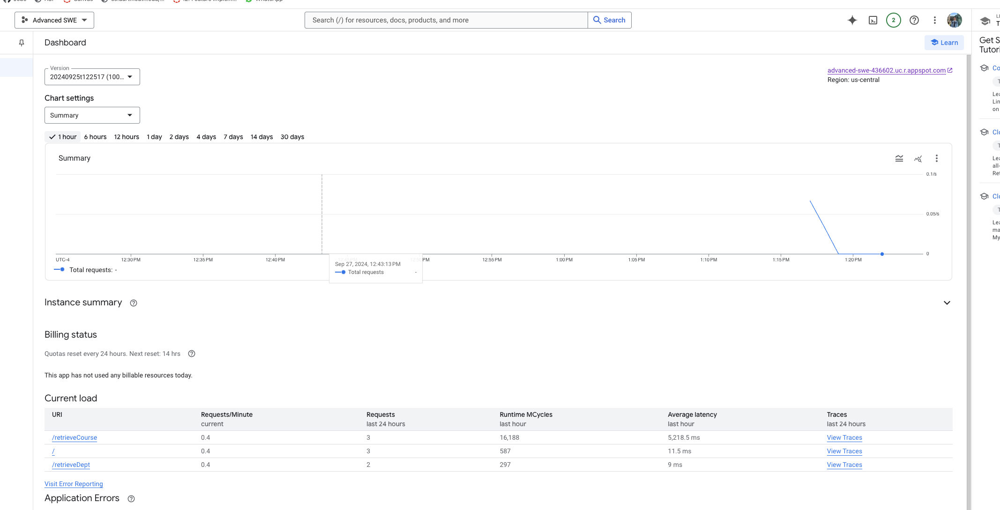

# COMS-4156-MiniProject 
This is the GitHub repo for the Miniproject for Advanced Software Engineering. 

## Building and Running a Local Instance

These are the system requirements: 

1. Maven 3.9.9: https://maven.apache.org/download.cgi Download and follow the installation instructions, be sure to set the bin as described in Maven's README as a new path variable by editing the system variables if you are on windows or by following the instructions for MacOS.

2. JDK 20.0.1: This project used JDK 20.0.1 for development.

This code was developed on MacOS, so these are the instructions for developing on the same platform with the same tools mentioned above. One can either fork or clone this repo, navigate to /IndividualProject, and the command: `mvn clean install`. This command will install all dependencies and packages neccessary for developing and testing a local instance. 

For consistency with the rest of the code, I reccoment periodically running the  `mvn checkstyle:check` or `mvn checkstyle:checkstyle` to generate the report.

To check code coverage, you can run  `mvn clean verify` which will generate an html report which can be found in `/IndividualProject/target/site/dev.coms4156.project.individualproject/index.html`, open that file with a browser or any HTML viewer to verify that code coverage is maintained to a reasonable threshold. 

There are two ways which one can test the application. 
1. In the case where the user wants to test with their own data, simply edit the `resestDataFile()` function in `/IndividualProject/src/main/IndividualProjectApplication.java`. Then run the following command: `mvn spring-boot:run -Dspring-boot.run.arguments="setup"`. Note that multiple testing sessions using this command, changes made to the database are not persistent since the "setup" argument effectively resests the database and inserts its own data. 
2. To test the application more closely to how the application will be run when deployed, run `mvn spring-boot:run`. When the application is ran with the command, changes made to the database are written to a file, which is read once again when the application is started again. Thus, the data is persistent between sessions. 

In either case, if successful, the application will be a local instance running on port 8080, you can test the endpoints of the application either using a browser or a service like Postman by pointing requests to: `http:127.0.0.1:8080/endpoint`

## Cloud based instance
As of September 27, 2024, there is a cloud instance running for this project which is reachable through: [this link](https://advanced-swe-436602.uc.r.appspot.com/)

### Link to the video which shows deployment
[https://youtu.be/BJ_REEhq2aI](https://youtu.be/BJ_REEhq2aI)

## Endpoints
This section describes the endpoints that this application service provides. 

### GET Endpoints
#### `/`, `/index`, `/home` 
Navigates to the home page of the application. 

#### `/retrieveDept`
Retrieves a departments course mapping.

#### `/retrieveCourse`
Displays the details of the requested course to the user or displays the proper error
message in response to the request.

#### `/isCourseFull`
Checks to see if a course is full.

#### `/getMajorCountFromDept`
Returns the number of majors in a given department.

#### `/idDeptChair`
Returns the department chair of a given department. 

#### `/findCourseLocation`
Returns the location for the specified course. 

#### `/findCourseInstructor`
Returns the instructor for the specified course. 

#### `/findCourseTime`
Returns the time for the specified course.

#### `/retrieveCourses`
Retrieves all courses for a specified course code across all departments. 

#### `/enrollStudentInCourse`
Attempts to enroll a student in a course. 

### PATCH Endpoints

#### `/addMajorToDept`
Attempts to add a major to a specified department. 

#### `/removeMajorFromDept`
Attempts to remove a major from a specified department. 

#### `/dropStudentFromCourse`
Attempts to drop a student from the specified course. 

#### `/setEnrollmentCount`
Changes the enrollment count of a specifed course. 

#### `/changeCourseTime`
Changes the time of the specified course. 

#### `/changeCourseTeacher` 
Changes the instructor for a specified course. 

#### `/changeCourseLocation`
Updates the location of a specified course. 

## Static Code Analysis
I used PMD to perform static code analysis. I used `java/quickstart.xml` as a reference. To run, navigate to the `/IndividualProject` directory and use the command `pmd check -f text -R rulesets/java/quickstart.xml -d .`.

## Continuous Integration/Development
This repository using GitHub Actions to perform continous integration. Currently, the workflow is configured in the `.github/main.yml` file. The workflow runs each time a push or merge is made to either the `test` or `main` branch. The test branch is made specifically for developing and testing the workflow via updates to the `main.yml` file. 

Everytime code is pushed to either of the mentioned branches, the style check is run, static code analysis, as well as all the unit test. In the case where there are any warnings produced from the style check or static code analysis, or any errors from the unit test -- the workflow fails. 

The reasoning behind this is that it ensures consistency of style between new code being pushed and the rest of the repository. 
